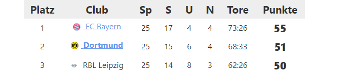

# 01 | Markup

Sie haben in der Vorlesung das Konzept von Auszeichnungssprachen kennengelernt und am Beispiel von XML erste Einblicke in die Arbeit mit Markupsprachen erhalten. In diesem Übungsblatt sollen sie die bisher erlernten Grundkenntnisse mit Hilfe eines Texteditors praktisch anwenden, um sich mit der Markupsprache XML vertraut zu machen. Laden Sie sich den Texteditor [Sublime Text](https://www.sublimetext.com/) herunter, mit welchem wir in diesem Kurs arbeiten werden.

## Aufgabe 1: XML-Wohlgeformheit 

Welcher der folgenden einzelnen Tags sind nach den Regeln der Wohlgeformtheit von XML valide und welche nicht? Begründen Sie ihre Entscheidung.

&lt;Kurs&gt; &lt;dozEnt&gt; &lt;Student/&gt; &lt;name&gt; &lt;Student Semester=3 &gt;&lt;Dozent alter="30"&gt; &lt;XMLelement&gt; &lt;_tag&gt; &lt;&gt; &lt;1anderesTag&gt; &lt;WebTech machtSpaß&gt; &lt;digital.humanities/&gt;

## Aufgabe 2: Erstellen einer XML-Datei

In dieser Aufgabe sollen Sie eine einfache XML-Datei erstellen, mit Sie die ersten drei Platzierungen dieser Fußballtabelle darstellen. 

Betrachten Sie die Tabelle und versuchen Sie alle Bestandteile der Darstellung der einzelnen Mannschaften in Ihrer XML abzubilden.
Überprüfen Sie ihr XML-Dokument anschließend mit Hilfe eines Validators (http://www.utilities-online.info/xsdvalidation/) auf Wohlgeformtheit.

## Aufgabe 3: 

